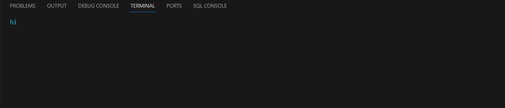
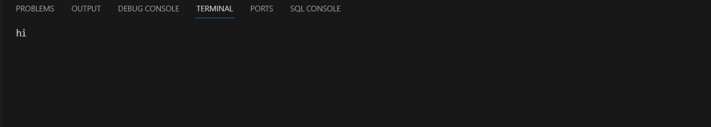
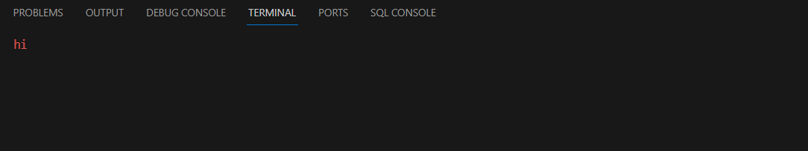
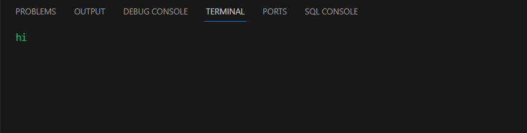

# add_colored_text
a method to display any number of options and when press any option the method run the function of this option .


## How To Use

from TerminalFramework call add_colored_text() and it takes 4 parameters : 

 1- x_pos : coordinate of x in screen.

 2- y_pos : coordinate of y in screen.

 3- text : the text you want to show in screen.

 4- color : the color of text .

 Note : all colors are (white, red, green, blue, yellow, cyan, magenta)


```python
TerminalFramework.add_colored_text(x_pos, y_pos, text, color)
```

**input**
```python
Terminal_Framework.add_colored_text(0,0,'hi','cyan')
Terminal_Framework.add_colored_text(0,0,'hi','magenta')
Terminal_Framework.add_colored_text(0,0,'hi','yellow')
Terminal_Framework.add_colored_text(0,0,'hi','white')
Terminal_Framework.add_colored_text(0,0,'hi','red')
Terminal_Framework.add_colored_text(0,0,'hi','green')
Terminal_Framework.add_colored_text(0,0,'hi','blue')
```


**output**











