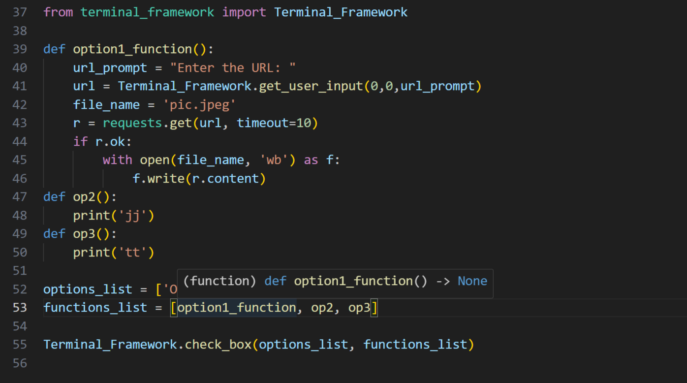
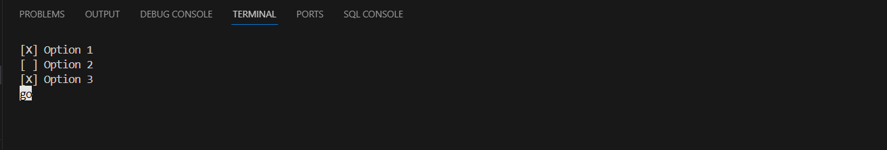

# check_box
a method to display check box and select more than one option and execution all checked option .


## How To Use  
from TerminalFramework call check_box() and it takes 2 parameters :

 1- options_list : list of the options you want to show in screen

 2- functions_list : list of functions each option take function by index


```python
Terminal_Framework.check_box(options_list, functions_list)
```

**input**
```python
def option1_function():
    url_prompt = "Enter the URL: "
    url = Terminal_Framework.get_user_input(0,0,url_prompt)
    file_name = 'pic.jpeg'
    r = requests.get(url, timeout=10)
    if r.ok:
        with open(file_name, 'wb') as f:
            f.write(r.content)
def op2():
    print('jj')
def op3():
    print('tt')

options_list = ['Option 1', 'Option 2', 'Option 3']
functions_list = [option1_function, op2, op3]
Terminal_Framework.display_options(options_list, functions_list)

Terminal_Framework.check_box(options_list, functions_list)
```



**output**

 if you select option1, the function of option1 will run .

 Note : fun1. download a picture from internet .
 


 function1 complete execution....
 
 function2 complete execution....
 
 The Resulte : 
 
 execution more than one function by checked the box and press go option .

