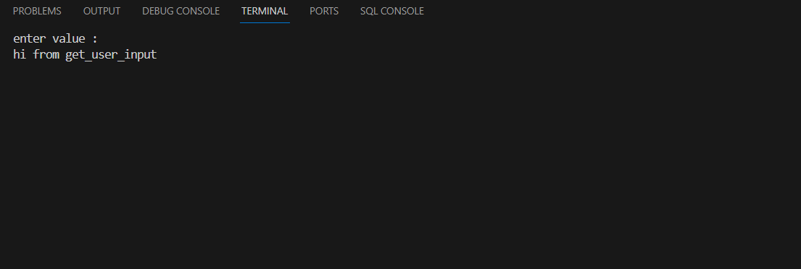

# get_user_input
a method to display any number of options and when press any option the method run the function of this option .


## How To Use  
from TerminalFramework call get_user_input() and it takes 3 parameters :

 1- x_pos : coordinate of x in screen

 2- y_pos : coordinate of y in screen

 3- text : the text you want to show in screen

```python
TerminalFramework.get_user_input(x_pos, y_pos, text)
```
**input**
```python
TerminalFramework.get_user_input(0, 0, 'enter value : ')
```


**output**



